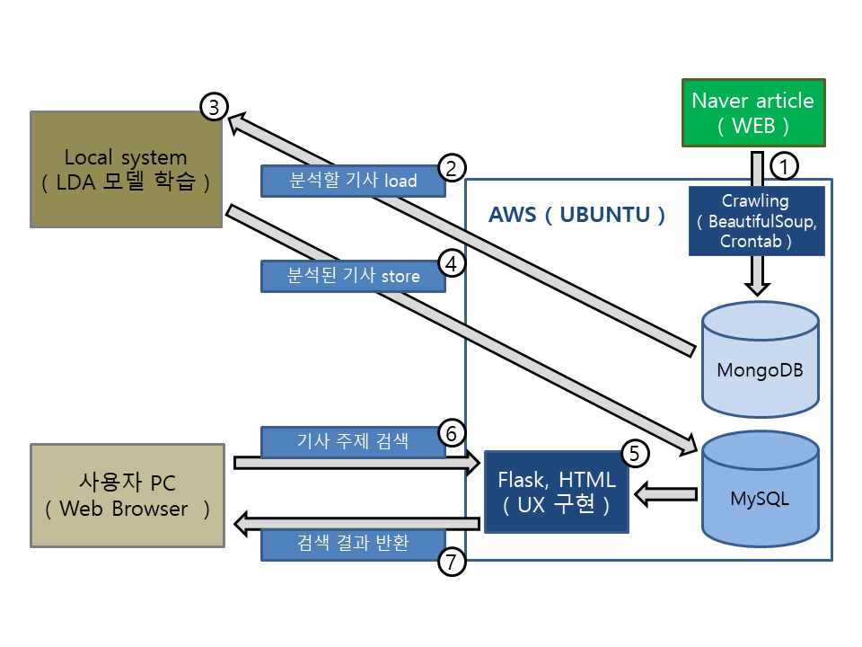

# 기사 주제 검색
# Article topic search 

## 목적
## Purpose

기사 검색 시에 특정 단어가 기사 중에서 낮은 빈도로 출현했을 때 해당 단어를 기사의 주제로 볼 수는 없을 것입니다. 원하는 주제의 기사를 검색할 때 해당 단어가 자주 출현하는 기사가 사용자가 원하는 주제의 기사일 가능성이 높으므로 이러한 가정에 기반을 두어 원하는 주제의 기사를 볼 수 있도록 도와주는 프로젝트입니다. 
You can't say that a topic of an article is when a word appears in low frequency. When certain word is present frequently that word could have high posibilyties to be the topic of an article you are searching. This project is base on this hypothesis to help search an article of certain topic.

## 기반 기술
## Foundation technique

* 환경(Environment) : AWS ( Ubuntu )  
* DB : MongoDB, MySQL  
* 언어(Language) : Python, HTML  
* Python 주요 라이브러리 : BeautifulSoup, Konlpy, Gensim, LDA, Flask  
* 스케쥴링(Scheduling) : Tmux, Crontab  

## 데이터 수집
## Data gathering

Python의 BeautifulSoup을 이용해 네이버 기사 수집. 수집 대상은 URL, 제목, 기사 내용. 컴퓨팅 파워의 한계 때문에 수집 대상 데이터는 네이버 기사의 IT/과학 카테고리로 제한. 
Gather articles from portal 'Naver' using BeautifulSoup in Python. The gathering target will be the URL, Title and Content. By limitation of computing power the target data would be only the articles in IT/Science category from portal 'Naver'.

## 데이터 전처리
## Data preprocessing

단어 중심으로 분석을 실시할 예정이므로, 핵심 단어들을 추출할 수 있도록 데이터 전처리. 
The analysis will be conducted by word, therefore data preprocessing will be done to extract the main words.

## 모델링
## Modeling

정제된 데이터를 LDA 모델에 학습. 전 기사를 통틀어 어떤 주제들이 있는지 lda 모델에 학습된다. 
The refined data will be used to train the LDA model. This way LDA model will be trained with the topic throughout the articles.

## 기사 분석 주제 저장
## Store analyzed article topic

학습 이후에 분석하기 원하는 기사를 LDA 모델로 분석하여 결과를 MySQL에 저장. 사용자에게 보다 빠르게 응답해주기 위해서 분석된 기사를 MySQL에 저장. 
After the training, the LDA model is used to analyze the article that you want and then store the result in MySQL. The stored article is to give the user quick response.

## 보완점
## Supplement point

* LDA 모델 학습시 설정하는 주제의 수에 따라 결과에 큰 영향을 미친다. 적절한 수의 주제를 선정하는 방법을 고려해야 함 
* 데이터 전처리를 더 정교하게 하면 보다 결과가 나을 것이라 예상 됨 
* 많은 데이터를 수집해서 학습시키면 보다 결과가 나을 것이라 예상 됨 
* 하나의 기사에서 주제로 선정될만한, 다시 말해서 자주 등장하는 단어가 여러 개일 수 있다. 보다 검색률을 좋게 하기 위해서 하나의 기사의 주제가 단일 단어가 아니라 자주 등장하는 여러 단어의 조합이라면 주제 검색률이 좋아 질 것이라 예상 됨 
* LDA model is affected by how many topics you set when training. A method to estimate the appropiate number of topics will need to be considered. 
* More exquisite data preprocessing will expect better result. 
* Collecting more data to traing the model will give better result. 
* An article might have several words that appears to be the topic. For better search result it should be better to combine words that appear often in an article.

## 구성도
## Diagram

# 노트북을 보시려면 [이곳](http://nbviewer.jupyter.org/github/migk153/article_topic_analyse/blob/master/Korean_nlp_article_topic.ipynb#topic=33&lambda=1&term=)을 클릭하시기 바랍니다
# To view the visualization in the notebook click [here](http://nbviewer.jupyter.org/github/migk153/article_topic_analyse/blob/master/Korean_nlp_article_topic.ipynb#topic=33&lambda=1&term=)
